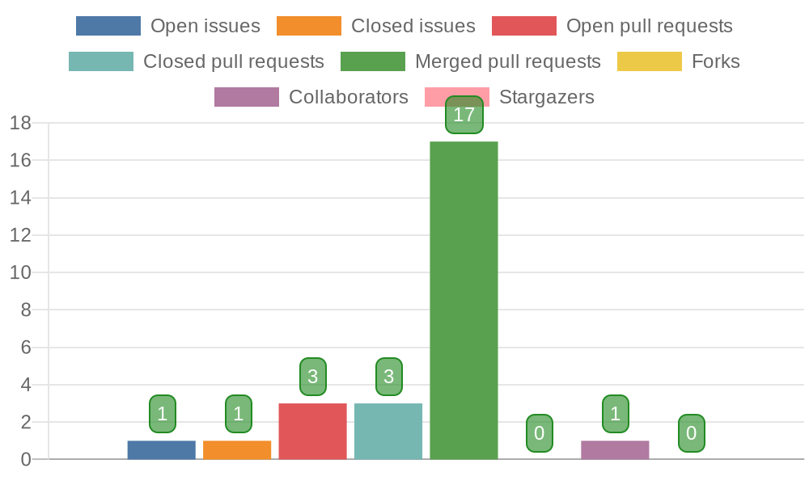

# Quick Chart Report



The Quick Chart Report is an essential tool for GitHub users who want to easily visualize their repository statistics. The Quick Chart Report was built based on two components: [repository-report](https://github.com/marketplace/actions/repository-report) and [QuickChart](https://quickchart.io/). The `repository-report` component is a Github Action that generates a report of repository statistics, while QuickChart is a tool for creating chart images from data. The Quick Chart Report action combines these two components to automatically generate chart images that display repository statistics such as issues, pull requests, and more, when triggered by events such as opening or closing an issue or pull request, or other GitHub events, or by a schedule.

## Prerequisites

Before using the Quick Chart Report Github Action, you need to complete the following steps:

- Generate a Github token with repository scope in your profile settings. This token is required to access your repository's data and generate the chart image.
  - Go to your GitHub profile settings.
  - Click on **Developer settings**.
  - Click on **Personal access tokens**.
  - Click on **Generate new token**.
  - Give the token a name and select the **repo** scope.
  - Click on **Generate token**.
  - Copy the generated token and use it in your workflow.

## Inputs

- **token** [required]: This token is necessary to access your repository's data and generate the chart image.
- **file_path** [optional]: This parameter specifies the directory where the chart image will be stored. If not specified, the chart image will be stored in the root directory (`.`).
  - default: `.`
- **file_name** [optional]: The file name of the chart image must end in `.png`. If not specified, the file name will be `chart-report.png`. You can also set a custom file name without the extension, for example, `my-repository-chart`. The output file will be `my-repository-chart.png`.
  - default: `chart-report.png`

## Usage

Here's an example GitHub workflow that triggers on issue events, pull requests to the main branch, and pushes to the main branch. It also includes a daily scheduled job to update the chart image.

```yaml
name: Quick Chart Report
on:
  issues:
    types: [opened, closed]
  pull_request:
    types: [opened, closed]
    branches: [main]
  push:
    branches: [main]
  schedule:
    - cron: '0 0 * * *'
jobs:
  generate-chart:
    runs-on: ubuntu-latest
    steps:
      - uses: actions/checkout@v3
        with:
          ref: main
          token: ${{secrets.TOKEN}}
      - uses: minuth/quickchart-report@main
        with:
          token: ${{secrets.TOKEN}}
```

This workflow specifies the events that will trigger the workflow, including opening and closing issues and pull requests to the main branch, pushes to the main branch, and a scheduled job that runs once a day. The `generate-chart` job specifies that the action will run on an Ubuntu environment, and includes the steps to checkout the repository and use the Quick Chart Report action.

Here is an example [repository](https://github.com/minuth/readme-chart-report-example) that uses Quick Chart Report to generate chart images and display them in the README file.

## Todo

- [ ]  Allow users to change the chart type
- [ ]  Allow users to show only the desired chart data
- [ ]  Output the chart URL
